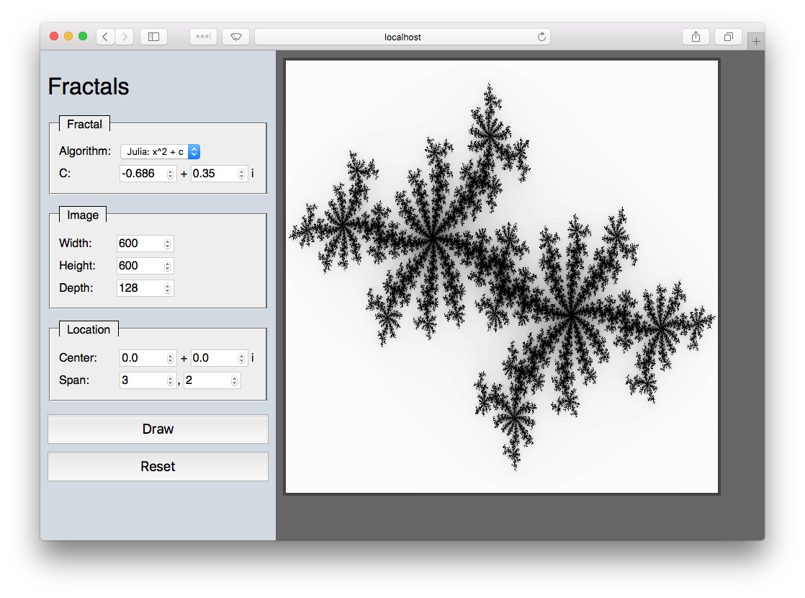
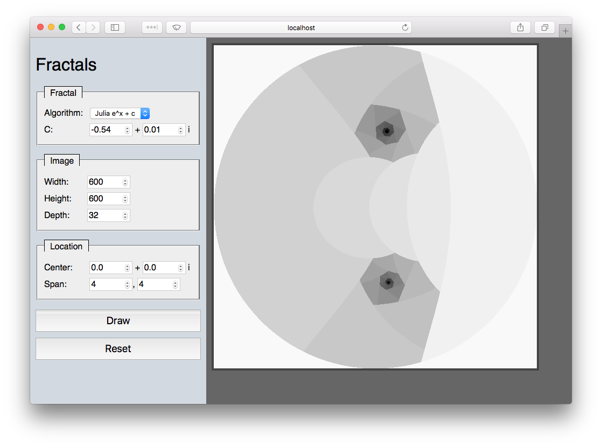

# Fractals-Go

This is a web-based version of my
JavaFX [JFXMandelbrot][1] project, written in Go!

## Screenshots

It looks at least as good as the JavaFX version, I think.

## Status

It has feature parity with the JavaFX version now, except the JavaFX version supports color. 

You can control:
 * The algorithm
 * The amount of recursion/colors (depth)
 * The width and height of the image  
 * The center and span of the image on the complex plane

And, clicking on the image itself centers it on your click, optionally
zooming it in or out.

## Obtaining/Running

You can `go get`:

    go get github.com/rwtodd/Go.Fractals

[1]: https://github.com/rwtodd/Java.JFXMandelbrot
